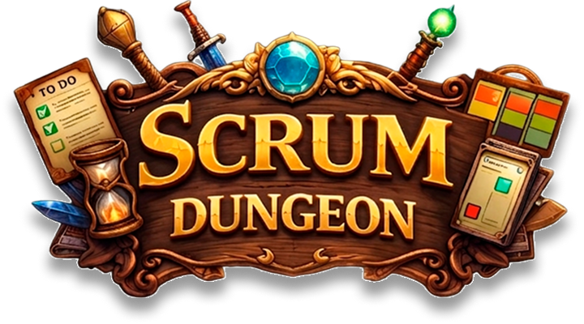
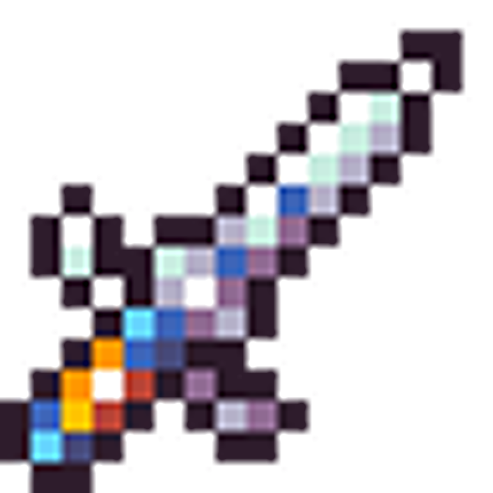
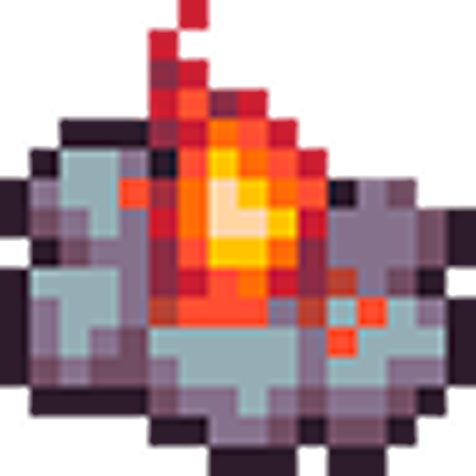

<div align="center">

<br>



<br>

> *"Aventureiro... os segredos do Scrum Master aguardam além desta porta.*
> *Você tem coragem de enfrentar a dungeon?"*
>
> — **O Corvo**

<br>

[](https://github.com/octopusCode26/ABP_DSM1_)
[](https://www.figma.com/design/96DMn9UVu2MT9xJIi5pBiQ/Prototipo_Scrum-Dungeon)
[](https://github.com/octopusCode26?query=is%3Aclosed&tab=projects)
[](./docs)

</div>

---

##  Sobre o Projeto

**Scrum Dungeon** é um RPG educativo desenvolvido como projeto integrador do 1º semestre do curso de **Desenvolvimento de Software Multiplataforma na FATEC Jacareí**, sob orientação do **Prof. Antonio Egydio São Thiago Graça** e acompanhamento do **Prof. Marcelo Augusto Sudo**.

Em vez de apresentar o Scrum com slides e teoria, o sistema transforma cada prática ágil em uma mecânica de jogo. O jogador progride por 5 níveis respondendo desafios interativos — e só avança ao demonstrar domínio do conteúdo anterior.

Desenvolvido pelo grupo **Octopus Code** em três sprints, aplicando na prática a mesma metodologia que ensina.

---

##  Como Funciona

O jogador percorre 5 níveis progressivos, cada um focado em uma etapa do Scrum:

```
ENTRADA
   │
   ▼
+----------+   +----------+   +----------+   +----------+   +----------+
|  NÍVEL I |-->| NÍVEL II |-->| NÍVEL III|-->| NÍVEL IV |-->|  NÍVEL V |
|          |   |          |   |          |   |          |   |          |
|Fundamentos|  | Papéis e |   | Cerimôni-|   | Artefatos|   |  Ciclo   |
|  do Scrum|   |  Times   |   |    as    |   |  e Fluxo |   | Completo |
+----------+   +----------+   +----------+   +----------+   +----------+
                                                                  │
                                                                  ▼
                                                          [CERTIFICADO]
```

**Regras da dungeon:**

| Regra | Detalhe |
|-------|---------|
| Questões por nível | 10 sorteadas de um banco de 30 |
| Composição | 3 fáceis · 4 médias · 3 difíceis |
| Tentativas | Máximo de 2 por nível |
| Nota do nível | A maior entre as tentativas |
| Resultado final | Média das melhores notas |
| Recompensa | Certificado digital ao completar os 5 níveis |

---

##  Tecnologias

<div align="center">


</div>

<br>

- **Frontend:** HTML, CSS e JavaScript puro com EJS
- **Backend:** Node.js + Express
- **Banco de dados:** PostgreSQL com DDL/DML explícitos
- **Arquitetura:** lógica de negócio centralizada no servidor
- **Versionamento:** Git Flow adaptado com Pull Requests
- **Protótipos:** Figma

**Destaques técnicos:** autenticação com JWT · controle de tentativas no back-end · geração dinâmica de questionários · certificado digital automático · progressão desbloqueável por desempenho

---

##  Como Executar

> **Pré-requisitos:** Node.js 18+ e PostgreSQL 14+ instalados.

**1. Clone o repositório**
```bash
git clone https://github.com/octopusCode26/scrum-dungeon.git
cd scrum-dungeon
npm install
```

**2. Configure o `.env`**

Crie um arquivo `.env` na raiz do projeto:

```env
PORT=3000

POSTGRES_HOST=localhost
POSTGRES_USER=postgres
POSTGRES_PASSWORD=sua_senha
POSTGRES_DB=abp
POSTGRES_PORT=5432

JWT_SECRET=sua_chave_secreta
DEFAULT_EXPIRES_IN_SECONDS=7200
```

> ⚠️ Nunca commite o `.env` — ele já está no `.gitignore`.

**3. Inicialize o banco**

Crie um banco chamado `abp` no pgAdmin 4 (PostgreSQL), depois execute:
```bash
npm run db:init
```

**4. Inserir cadastro de Admin (Somente se necessitar acessar painel para efetuar alterações nas questões cadastradas)**
```bash
npm run db:admin
```

**5. Inicie o servidor**
```bash
npm run dev
```

Acesse em `http://localhost:3000`

---

##  Sprints

| Sprint | Período | Principais Entregas | Status |
|--------|---------|---------------------|--------|
| [**Sprint 1**](./docs/sprints/sprint-1.md) | 13/04 — 30/04/2026 | Prototipação · Diagramas UML · Nível 1 | ✔️ Finalizada |
| [**Sprint 2**](./docs/sprints/sprint-2.md) | 04/05 — 21/05/2026 | Cadastro · Login · Sistema de avaliação · Mapa | ✔️ Finalizada |
| [**Sprint 3**](./docs/sprints/sprint-3.md) | 25/05 — 11/06/2026 | Capítulos finais · Histórico · Resultado final | ✔️ Finalizada |

---

##  Documentação

A documentação completa está organizada em [`/docs`](./docs):

| Documento | Conteúdo |
|-----------|----------|
| [Requisitos](./docs/requisitos.md) | RF, RNF, Restrições e User Stories |
| [Arquitetura](./docs/arquitetura.md) | Diagrama de arquitetura, rotas e modelo de dados |
| [Sprint 1](./docs/sprints/sprint-1.md) | Backlog, burndown e demonstração |
| [Sprint 2](./docs/sprints/sprint-2.md) | Backlog, burndown e demonstração |
| [Sprint 3](./docs/sprints/sprint-3.md) | Backlog, burndown e demonstração |

---

##  Os Aventureiros

<div align="center">


**`<OCTOPUS_CODE />`**

<br>

<table>
  <tr>
    <td align="center">
      <a href="https://github.com/VtecturboBr">
        <br>
        <sub><b>Alef Oliveira</b></sub>
      </a><br><sub>Desenvolvedor</sub>
    </td>
    <td align="center">
      <a href="https://github.com/Cauaisq">
        <br>
        <sub><b>Cauã Silva</b></sub>
      </a><br><sub>Desenvolvedor</sub>
    </td>
    <td align="center">
      <a href="https://github.com/EnzoSuzukiProkopas">
        <br>
        <sub><b>Enzo Prokopas</b></sub>
      </a><br><sub>Desenvolvedor</sub>
    </td>
  </tr>
  <tr>
    <td align="center">
      <a href="https://github.com/igoriansen">
        <br>
        <sub><b>Igor Iansen</b></sub>
      </a><br><sub>Desenvolvedor</sub>
    </td>
    <td align="center">
      <a href="https://github.com/LorenzoOMN">
        <br>
        <sub><b>Lorenzo Nogueira</b></sub>
      </a><br><sub>Scrum Master</sub>
    </td>
    <td align="center">
      <a href="https://github.com/renanrmsantos14">
        <br>
        <sub><b>Renan Santos</b></sub>
      </a><br><sub>Desenvolvedor</sub>
    </td>
  </tr>
  <tr>
    <td align="center">
      <a href="https://github.com/thiagosantos-17">
        <br>
        <sub><b>Thiago Santos</b></sub>
      </a><br><sub>Desenvolvedor</sub>
    </td>
    <td align="center">
      <a href="https://github.com/vitorhirch">
        <br>
        <sub><b>Vitor Hirch</b></sub>
      </a><br><sub>Product Owner</sub>
    </td>
    <td align="center">
      <a href="https://github.com/PatyMaidana">
        <br>
        <sub><b>Patricia Maidana</b></sub>
      </a><br><sub>Desenvolvedor</sub>
    </td>
  </tr>
</table>

</div>

---

<div align="center">


<br>

*"Obrigado por explorar a Scrum Dungeon."*

`1DSM · FATEC Jacareí · 2026`

</div>
