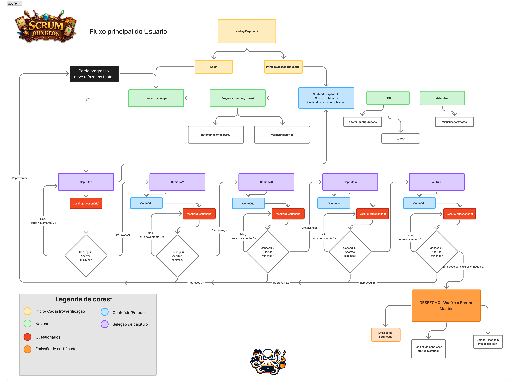

# 📜 Requisitos — Scrum Dungeon

> Voltar para o [README](../README.md).

---

## Funcionais

| ID | Requisito |
|----|-----------|
| RF-01 | Cadastro com CPF, nome, e-mail e senha |
| RF-02 | Login por CPF e senha |
| RF-03 | Sorteio de 10 questões por nível (banco de 30) |
| RF-04 | Questões em três dificuldades: fácil, médio e difícil |
| RF-05 | Composição: 3 fáceis · 4 médias · 3 difíceis |
| RF-06 | Máximo de 2 tentativas por nível |
| RF-07 | Nota do nível = maior entre as tentativas |
| RF-08 | Resultado final = média das notas por nível |
| RF-09 | Certificado digital com nome, CPF, e-mail, data e notas |
| RF-10 | Histórico de tentativas com data, hora e pontuação |
| RF-11 | Consulta de progresso em tempo real |
| RF-12 | *(Opcional)* Área administrativa de questões |

---

## Não Funcionais

| ID | Requisito |
|----|-----------|
| RNF-01 | Interface simples, clara e responsiva |
| RNF-02 | Tempo de resposta adequado |
| RNF-03 | Conformidade com a LGPD |
| RNF-04 | Notas e tentativas não manipuláveis via front-end |
| RNF-05 | Backlog, sprints, versionamento e DoD documentados |
| RNF-06 | Documentação mínima: modelo de dados, rotas e instruções |

---

## Restrições de Projeto

| ID | Restrição |
|----|-----------|
| RP-01 | Front-end exclusivamente com HTML, CSS e JavaScript puro — sem frameworks ou bibliotecas de UI |
| RP-02 | Banco de dados exclusivamente PostgreSQL, com DDL e DML explícitos — sem ORMs |
| RP-03 | Sistema entregue e funcional dentro do prazo das 3 sprints definidas |
| RP-04 | Toda lógica de negócio (cálculo de notas, controle de tentativas) deve residir no back-end |
| RP-05 | Versionamento seguindo Git Flow adaptado, com contribuições via Pull Request aprovado |

---

## User Stories

| ID Referência | Remetente | Instrução | Finalidade |
|---------------|-----------|-----------|------------|
| RF-01 / RF-02 / RNF-03 | Usuário | Quero me cadastrar informando CPF, nome completo, e-mail e senha, e depois fazer login com CPF e senha. | Para criar minha conta e acessar o sistema de avaliações de forma segura. |
| RF-03 / RF-04 / RF-05 | Usuário | Quero receber uma prova com questões aleatórias classificadas por nível e dificuldade, com distribuição equilibrada. | Para testar meu conhecimento de forma justa e balanceada. |
| RF-04 / RNF-04 | Admin | Quero classificar as questões por nível e dificuldade, com as regras de cálculo protegidas no backend. | Para garantir avaliações equilibradas e evitar manipulações indevidas. |
| RF-06 / RF-07 | Usuário | Quero ter até 2 tentativas por nível, com a melhor nota sendo considerada. | Para melhorar meu desempenho e ter meu melhor resultado reconhecido. |
| RF-08 / RF-10 / RF-11 / RNF-01 / RNF-02 | Usuário | Quero visualizar minha média final, histórico de tentativas e progresso nos níveis, em qualquer dispositivo e com carregamento rápido. | Para acompanhar minha evolução de forma fluida e acessível. |
| RF-09 | Usuário | Quero gerar um certificado com meus dados e desempenho ao ser aprovado. | Para comprovar minha conclusão no sistema de avaliações. |
| RNF-05 / RNF-06 | Avaliador | Quero que a equipe utilize práticas ágeis e disponibilize documentação básica do projeto. | Para acompanhar a evolução do projeto e entender sua estrutura e funcionamento. |

---

## User Flow

